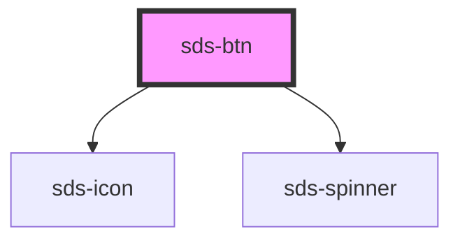

# sds-btn

<!-- Auto Generated Below -->

## Properties

| Property     | Attribute    | Description | Type                                                                                                                                                                            | Default        |
| ------------ | ------------ | ----------- | ------------------------------------------------------------------------------------------------------------------------------------------------------------------------------- | -------------- |
| `appearance` | `appearance` |             | `"destructive" \| "primary" \| "primaryondark" \| "secondary" \| "secondaryondark" \| "type" \| "type_sm" \| "typeicon" \| "typeiconondark" \| "typeondark" \| "typeondark_sm"` | `'primary'`    |
| `disabled`   | `disabled`   |             | `boolean`                                                                                                                                                                       | `false`        |
| `fullwidth`  | `fullwidth`  |             | `boolean`                                                                                                                                                                       | `false`        |
| `icon`       | `icon`       |             | `string`                                                                                                                                                                        | `''`           |
| `label`      | `label`      |             | `string`                                                                                                                                                                        | `'Text label'` |
| `link`       | `link`       |             | `string`                                                                                                                                                                        | `null`         |
| `loaded`     | `loaded`     |             | `boolean`                                                                                                                                                                       | `false`        |
| `loading`    | `loading`    |             | `boolean`                                                                                                                                                                       | `false`        |
| `outbound`   | `outbound`   |             | `boolean`                                                                                                                                                                       | `false`        |
| `type`       | `type`       |             | `string`                                                                                                                                                                        | `'button'`     |

## Dependencies

### Depends on

- [sds-icon](../sds-icon)
- [sds-spinner](../sds-spinner)

### Graph

----------------------------------------------

*Built with [StencilJS](https://stenciljs.com/)*
