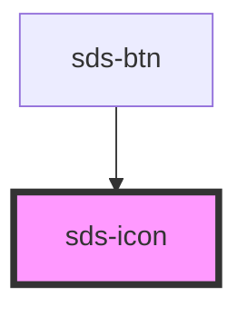

# sds-icon

<!-- Auto Generated Below -->

## Properties

| Property            | Attribute | Description                                   | Type     | Default     |
| ------------------- | --------- | --------------------------------------------- | -------- | ----------- |
| `icon` _(required)_ | `icon`    | The glyph key name as defined in IconsList.ts | `string` | `undefined` |

## Dependencies

### Used by

 - [sds-btn](../sds-btn)

### Graph

----------------------------------------------

*Built with [StencilJS](https://stenciljs.com/)*
