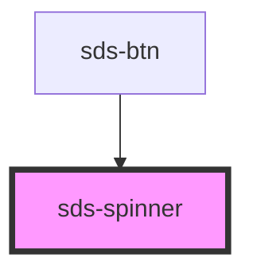

# sds-spinner

<!-- Auto Generated Below -->

## Properties

| Property  | Attribute | Description | Type      | Default     |
| --------- | --------- | ----------- | --------- | ----------- |
| `color`   | `color`   |             | `string`  | `''`        |
| `loaded`  | `loaded`  |             | `boolean` | `undefined` |
| `loading` | `loading` |             | `boolean` | `undefined` |

## Dependencies

### Used by

 - [sds-btn](../sds-btn)

### Graph

----------------------------------------------

*Built with [StencilJS](https://stenciljs.com/)*
